#
坚果pro快速上手教程

快速教程共分为三个部分：基础操作、进阶快捷操作和高级快捷操作。

其中进阶快捷操作和高级快捷操作部分学习成本较高(其实也还好)。

### 敲黑板划重点：

基础操作部分：下拉状态栏、进程管理、输入法操作

进阶快捷操作：搜索、语音搜索

高阶快捷操作所有视频内容。

## 基础操作篇

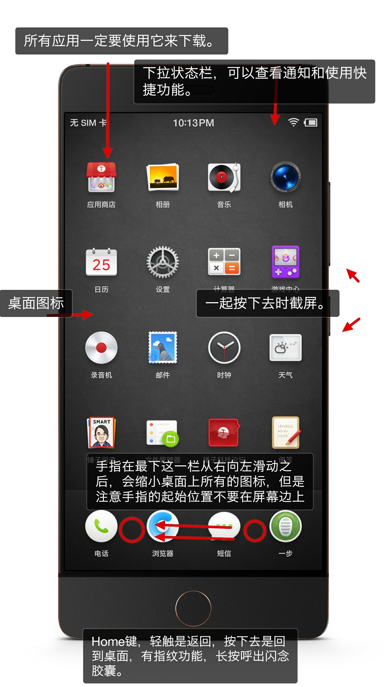

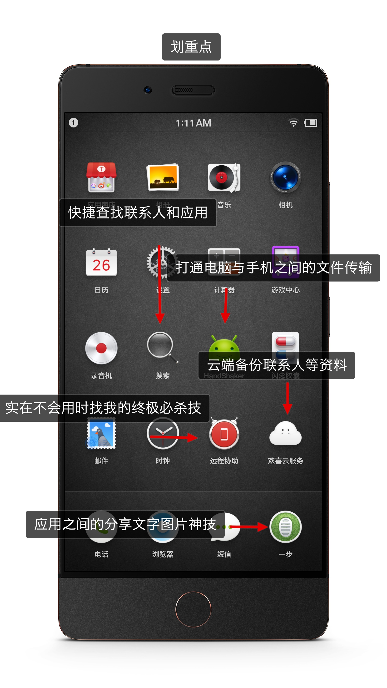

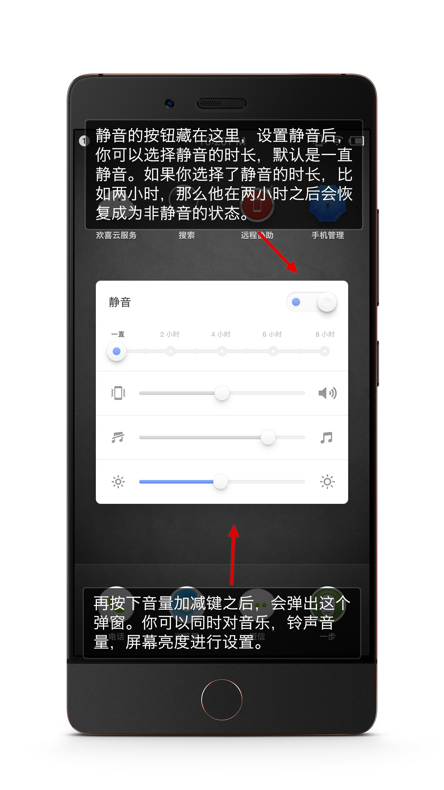

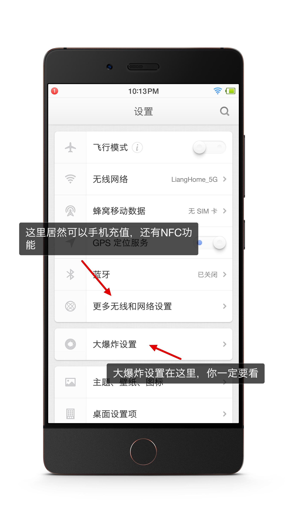

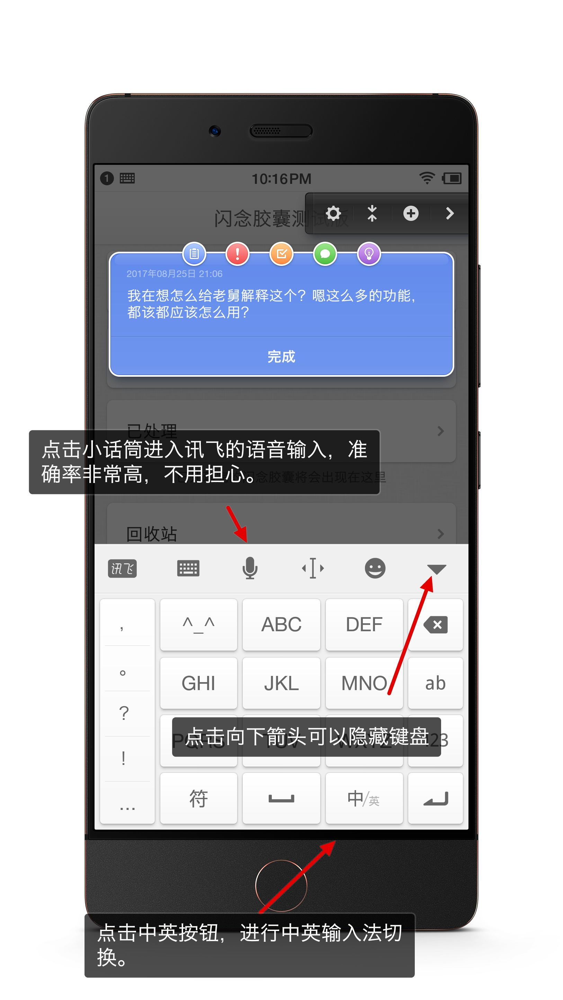

## 进阶快捷操作

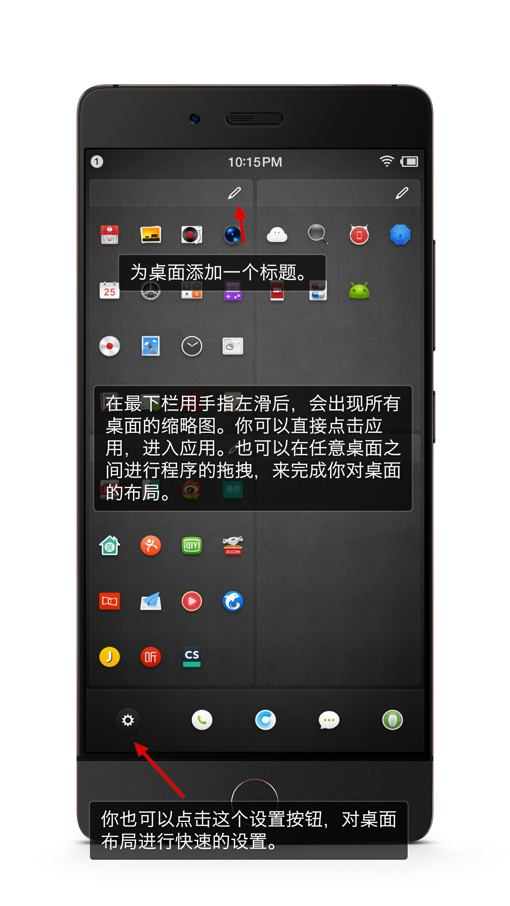

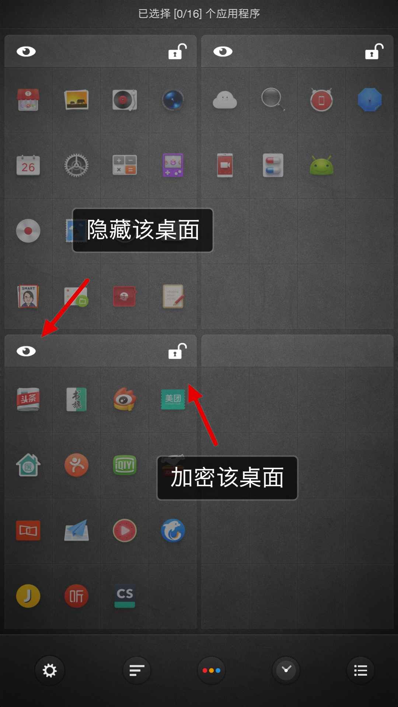

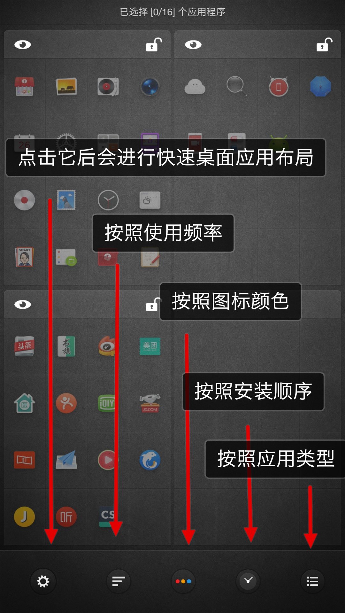

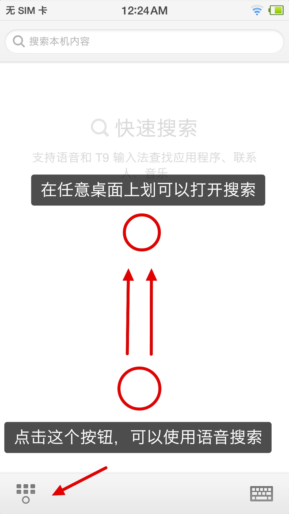

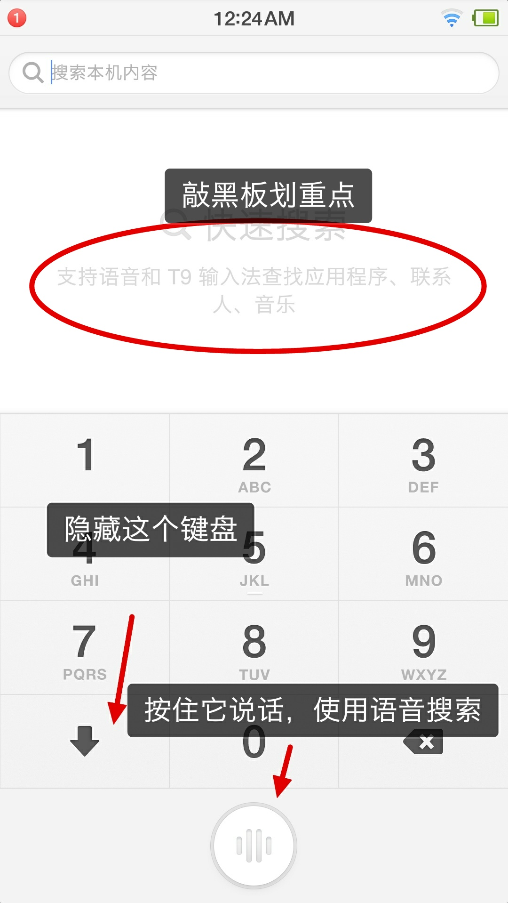

## 高级快捷操作(一步、大爆炸、闪念胶囊)

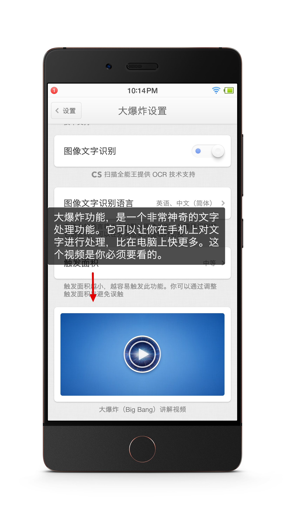

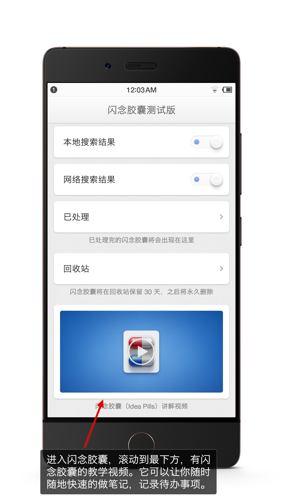

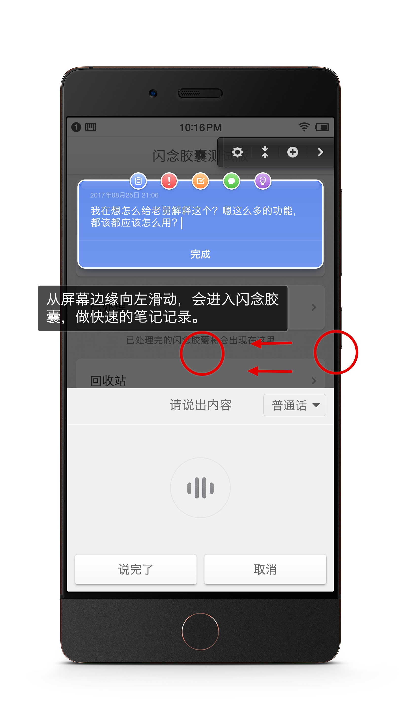

